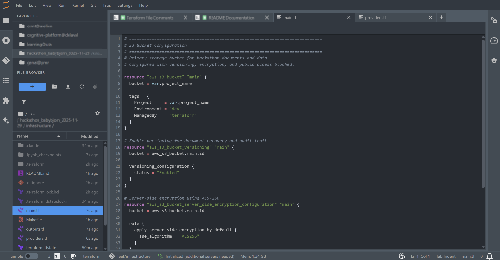

# jupyterlab_terraform_file_type_extension

[](https://github.com/stellarshenson/jupyterlab_terraform_file_type_extension/actions/workflows/build.yml)
[](https://www.npmjs.com/package/jupyterlab_terraform_file_type_extension)
[](https://pypi.org/project/jupyterlab-terraform-file-type-extension/)
[](https://pepy.tech/project/jupyterlab-terraform-file-type-extension)
[](https://jupyterlab.readthedocs.io/en/stable/)
[](https://kolomolo.com)
[](https://www.paypal.com/donate/?hosted_button_id=B4KPBJDLLXTSA)

A JupyterLab extension providing comprehensive Terraform/HCL support with syntax highlighting and custom file type recognition.



## Features

Comprehensive Terraform and HCL editing support in JupyterLab with syntax highlighting that distinguishes blocks, variables, functions, and expressions.

**File recognition**:

- Terraform: `*.tf`, `*.tfvars`, `*.tfstate.*`
- HCL: `*.hcl`, `*.tfstack.hcl`, `*.tfcomponent.hcl`, `*.tfdeploy.hcl`, `*.tftest.hcl`, `*.tfmock.hcl`, `*.tfquery.hcl`
- Purple HashiCorp Terraform icon in file browser

**Highlighting coverage**:

- Block types: `resource`, `module`, `provider`, `variable`, `output`, `locals`, `data`, `terraform`
- 100+ built-in Terraform functions
- String interpolation with `${}` and `%{}` directives
- Heredoc strings and escape sequences
- Type keywords, constants, and operators
- Comments: `#`, `//`, `/* */`

Yes, this is yet another mass-produced file type extension. We are almost embarrassed by how utterly unremarkable it is - just the same boilerplate code with different keywords swapped in. But someone had to do it, and here we are. Syntax highlighting shamelessly borrowed from [hashicorp/vscode-terraform](https://github.com/hashicorp/vscode-terraform) - we stand on the shoulders of giants, or at least peek over their fence.

## Requirements

- JupyterLab >= 4.0.0

## Install

To install the extension, execute:

```bash
pip install jupyterlab_terraform_file_type_extension
```

## Uninstall

To remove the extension, execute:

```bash
pip uninstall jupyterlab_terraform_file_type_extension
```
